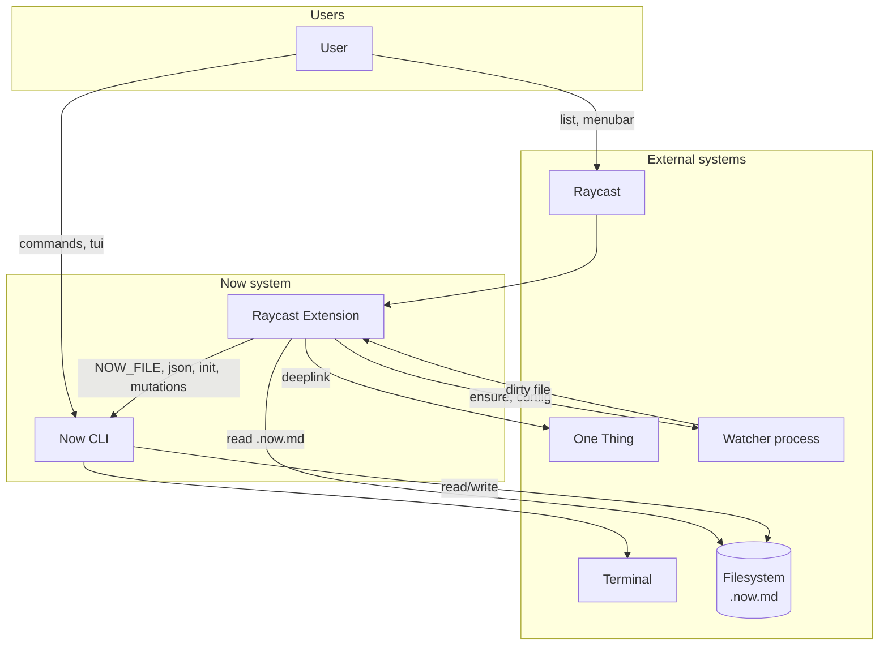

# C1 – System Context

High-level view of the Now system and its users and external systems. The extension reads `.now.md` directly when possible (fast path) and invokes the CLI for mutations and when direct read fails.

