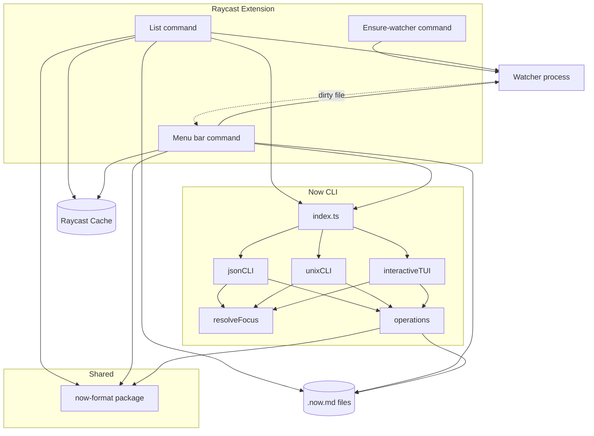

# C2 – Containers

Main technical building blocks: CLI, Raycast Extension, shared format package, and watcher.

```mermaid
flowchart TB
  subgraph Extension["Raycast Extension"]
    List[List command]
    Menubar[Menu bar command]
    EnsureWatcher[Ensure-watcher command]
  end
  subgraph CLI["Now CLI"]
    Index[index.ts]
    JsonCLI[jsonCLI]
    UnixCLI[unixCLI]
    TUI[interactiveTUI]
    Resolve[resolveFocus]
    Ops[operations]
  end
  subgraph Shared["Shared"]
    NF[now-format package]
  end
  FS[(.now.md files)]
  Cache[(Raycast Cache)]
  W[Watcher process]
  List --> Cache
  Menubar --> Cache
  List --> Index
  Menubar --> Index
  List --> FS
  Menubar --> FS
  List --> NF
  Menubar --> NF
  JsonCLI --> Resolve
  JsonCLI --> Ops
  UnixCLI --> Resolve
  UnixCLI --> Ops
  TUI --> Resolve
  TUI --> Ops
  Ops --> NF
  Ops --> FS
  Index --> JsonCLI
  Index --> UnixCLI
  Index --> TUI
  EnsureWatcher --> W
  List --> W
  Menubar --> W
  W -.->|dirty file| Menubar
```
