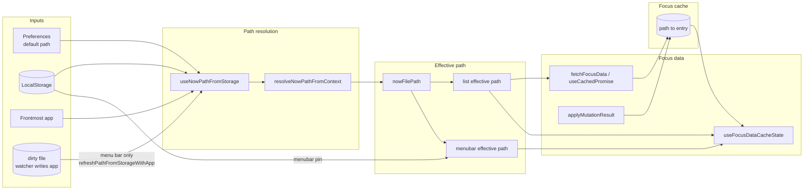

# C3 – Data flow (path → effective path → focus)

How path resolution, effective path (with pinning), and focus data connect. Focus cache is the sync point between list and menu bar. List effective path = `pinnedPath ?? nowFilePath` (in-session); menubar effective path = `menubarPinned ?? nowFilePath` (menubar pin from LocalStorage).

**App context for path resolution** comes from two places: (1) **Frontmost app** — when the command is already open, `getFrontmostApplication()` is used. (2) **Dirty file** — when the menu bar is opened (including via the watcher’s deeplink after file change or app switch), it reads the dirty file once on mount; if the write is recent (&lt;60s) and includes `app`, it calls `refreshPathFromStorageWithApp(app)` so the correct file is shown even though Raycast may now be frontmost. The Swift watcher writes `{ ts, app? }` to the dirty file on each trigger.

