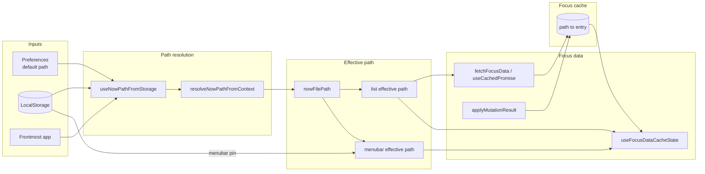

# C3 – Data flow (path → effective path → focus)

How path resolution, effective path (with pinning), and focus data connect. Focus cache is the sync point between list and menu bar. List effective path = `pinnedPath ?? nowFilePath` (in-session); menubar effective path = `menubarPinned ?? nowFilePath` (menubar pin from LocalStorage).

