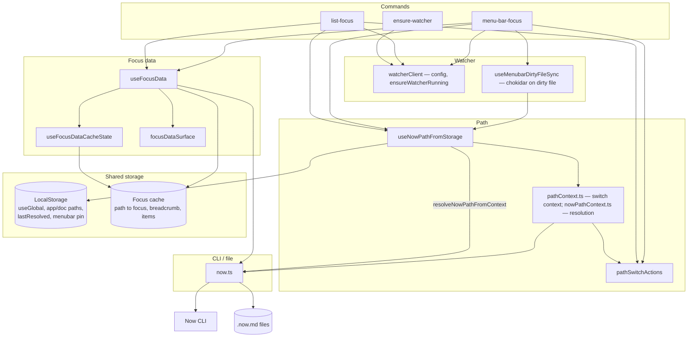

# C3 – Extension components (path + focus data)

Components inside the Raycast extension: path resolution, path context UI, focus data hooks, shared cache, watcher integration, and CLI/file bridge. Path resolution is implemented by `resolveNowPathFromContext` in `nowPathContext.ts` (re-exported from `now.ts`); `useNowPathFromStorage` calls it and reads/writes LocalStorage.

**Watcher**: A Swift binary (`assets/now-watcher`) is started by `ensure-watcher` (background interval) and when list-focus or menu-bar-focus run (if health check fails). It watches configured .now.md paths (via `DispatchSource.makeFileSystemObjectSource` with `.write`) and subscribes to `NSWorkspace.didActivateApplicationNotification`. On file change or app activation it debounces (300ms), writes `{ ts, app? }` to a dirty file, and opens the menu-bar-focus deeplink (background, `open -g`). The menu bar uses **chokidar** on the dirty file to refresh in-process when already open; on any open it also reads the dirty file once on mount and, if the write is recent (&lt;60s) and includes `app`, calls `refreshPathFromStorageWithApp(app)` so the correct file is resolved.

