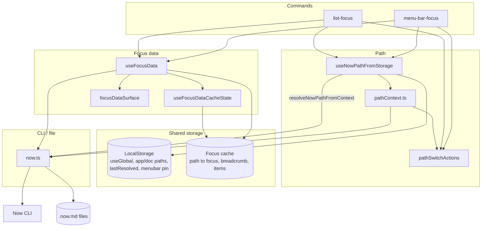

# C3 – Extension components (path + focus data)

Components inside the Raycast extension: path resolution, path context UI, focus data hooks, shared cache, and CLI/file bridge. Path resolution is implemented by `resolveNowPathFromContext` in `now.ts`; `useNowPathFromStorage` calls it and reads/writes LocalStorage.

