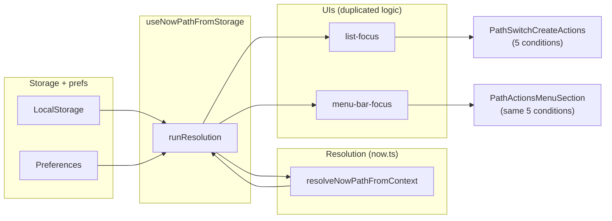
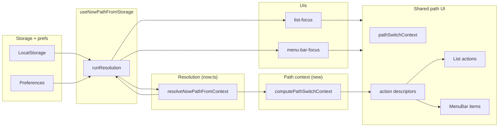

# Refactor: Path context and shared path-switch UI

**Note:** Document-specific Now file tracking (switchToDocument, createForDocument, docPathForCurrent, currentDocumentPath) was later removed from the codebase. This doc is historical; the current implementation has global + app path switching only.

Address the **"Which Now file" path-resolution** complexity knot: one source of truth for "available switch/create options" and a single path-switch UI layer so list-focus and menu-bar-focus don’t re-derive the same conditions.

**Status: Completed.** Old components (`PathSwitchCreateActions`, `PathActionsMenuSection`) removed; path logic lives in `pathContext.ts` and `pathSwitchActions.tsx`.

---

## Current state (before)



- **Resolution** is already centralized in `resolveNowPathFromContext` (order: useGlobal → document → app → last used → default).
- **Visibility** of the five path actions is re-derived in two places with the same logic:
  - Switch to Global: `effectivePath !== defaultPath` / `nowFilePath !== defaultPath`
  - Switch to Document: `docPathForCurrent && effectivePath !== docPathForCurrent`
  - Switch to App: `appPathForCurrent && currentApp && effectivePath !== appPathForCurrent`
  - Create for Document: `currentDocumentPath && !docPathForCurrent`
  - Create for App: `currentApp && !appPathForCurrent`
- **Labels** (e.g. "Now", "Now: Document — notes.md") are also duplicated (`nowInputLabel` in both list and menu bar).
- **Callbacks** (switchToGlobal, switchToDocument, …) are implemented separately in list-focus and menu-bar-focus with similar but not identical sequences (list uses setPinnedPath + applyMutationResult; menu uses clearMenubarPin + refresh).

---

## Target state (after)



- **Path switch context** is a small, pure data shape: “active path” + list of “available switch” and “available create” options (path + label). No UI.
- **One function** `computePathSwitchContext(activePath, defaultPath, result from resolveNowPathFromContext, currentApp, currentDocumentPath)` returns that shape. Optionally the same helper can return the **context label** (“Now”, “Now: Document — …”, etc.) so `nowInputLabel` is not duplicated.
- **One layer** that turns that context into **action descriptors** (id, title, icon, onAction). List and MenuBar each have a **thin renderer** that maps descriptors to `<Action ... />` or `<MenuBarExtra.Item ... />`.
- **Callbacks** stay in the commands (list-focus / menu-bar-focus) because they need command-specific deps (setPinnedPath, refresh, applyMutationResult, clearMenubarPin, etc.). The shared layer only decides *which* actions are visible and their titles; the command passes the onAction implementations.

---

## Design: path context type and compute function

**Location:** `extensions/raycast/src/lib/pathContext.ts` (new). Depends only on `./now` for `documentDisplayName` and types; no React, no Raycast.

**Types:**

```ts
// Input: same inputs that today the UIs use to derive visibility.
export type PathSwitchContextInput = {
  activePath: string | null;       // effectivePath (list) or effectiveNowPath (menubar)
  defaultPath: string;
  docPathForCurrent: string | null;
  appPathForCurrent: string | null;
  currentApp: { name: string; bundleId?: string } | null;
  currentDocumentPath: string | null;
};

// One entry for each of the five actions; visible iff path (and optional label) is set.
export type PathSwitchContext = {
  switchToGlobal: { visible: true; path: string } | { visible: false };
  switchToDocument: { visible: true; path: string; label: string } | { visible: false };
  switchToApp: { visible: true; path: string; label: string } | { visible: false };
  createForDocument: { visible: true; suggestedPath: string; displayName: string } | { visible: false };
  createForApp: { visible: true; suggestedPath: string; displayName: string } | { visible: false };
  contextLabel: string;  // "Now" | "Now: Document — …" | "Now: AppName"
};
```

**Function:**

```ts
export function computePathSwitchContext(input: PathSwitchContextInput): PathSwitchContext;
```

- `switchToGlobal.visible = input.activePath !== input.defaultPath` (and path = defaultPath).
- `switchToDocument.visible = !!input.docPathForCurrent && input.activePath !== input.docPathForCurrent`; path = docPathForCurrent, label = documentDisplayName(currentDocumentPath).
- `switchToApp.visible = !!input.appPathForCurrent && !!input.currentApp && input.activePath !== input.appPathForCurrent`; path = appPathForCurrent, label = currentApp.name.
- `createForDocument.visible = !!input.currentDocumentPath && !input.docPathForCurrent`; suggestedPath = suggestedNowPathForDocument(currentDocumentPath), displayName = documentDisplayName(currentDocumentPath).
- `createForApp.visible = !!input.currentApp && !input.appPathForCurrent`; suggestedPath = suggestedNowPathForApp(currentApp), displayName = currentApp.name.
- `contextLabel`: same ternary as current `nowInputLabel` (default → document → app → "Now").

`pathContext.ts` will import `documentDisplayName`, `suggestedNowPathForDocument`, `suggestedNowPathForApp`, and `resolveNowFilePath` from `./now` (or take resolved paths from caller to keep the file free of path resolution). Prefer: caller passes already-resolved paths; pathContext only needs activePath, defaultPath, docPathForCurrent, appPathForCurrent, currentApp, currentDocumentPath. Then suggestedPath for creates can be passed in or computed here; if computed here we need to import from now. Easiest: pathContext imports from now and receives unresolved doc/app paths so it can call suggestedNowPathForDocument/ForApp and resolveNowFilePath. So input type stays as above; for create we need currentDocumentPath and currentApp for display names, and we’ll call suggested* + resolve in pathContext.

---

## Design: action descriptors and shared renderers

**Action descriptor** (no Raycast types in the descriptor; just data):

```ts
export type PathActionDescriptor =
  | { id: 'switch-global'; title: string; path: string }
  | { id: 'switch-document'; title: string; path: string }
  | { id: 'switch-app'; title: string; path: string }
  | { id: 'create-document'; title: string; suggestedPath: string; displayName: string }
  | { id: 'create-app'; title: string; suggestedPath: string; displayName: string };
```

**Function:**

```ts
export function pathSwitchContextToDescriptors(ctx: PathSwitchContext): PathActionDescriptor[];
```

Returns an array of descriptors for which `visible === true`, in a stable order (e.g. creates first, then switches: create doc, create app, switch global, switch document, switch app — or match current UI order).

**Shared renderers:**

- **For List:** a component `PathSwitchActionsList({ descriptors, callbacks })` where `callbacks` has `onSwitchGlobal()`, `onSwitchDocument()`, … and the component maps descriptors to `<Action title={...} onAction={callbacks[id]} />` with the right icon. So list-focus passes the same callbacks it already has; we only change how we decide which actions to show (from context) and how we render them (one loop).
- **For MenuBar:** same descriptors, `PathSwitchActionsMenuBar({ descriptors, callbacks })` maps to `<MenuBarExtra.Item title={...} onAction={...} />`.

Callbacks stay in the commands because they differ (list: setPinnedPath, applyMutationResult, refresh; menu: clearMenubarPin, setNowFilePath, setSourceLabel, refreshPathFromStorage, refresh). So the shared code is:
1. `pathContext.ts`: `computePathSwitchContext`, `pathSwitchContextToDescriptors`, and export `contextLabel` from the same context so both UIs use it for section title / search placeholder.
2. `PathSwitchActionsList.tsx` (or in list-focus): takes `descriptors` + `callbacks`, renders `<Action ... />` for each.
3. `PathSwitchActionsMenuBar.tsx` (or in menu-bar-focus): takes `descriptors` + `callbacks`, renders `<MenuBarExtra.Item ... />` for each.

We can put the two render components in one file `pathSwitchActions.tsx` that exports both, or keep one next to list and one next to menu bar. One file is simpler: `extensions/raycast/src/lib/pathSwitchActions.tsx`.

---

## Implementation plan

### Phase 1: Add path context module (de-risk: pure logic, easy to test)

1. **Add `extensions/raycast/src/lib/pathContext.ts`**
   - Define `PathSwitchContextInput`, `PathSwitchContext`, `PathActionDescriptor`.
   - Implement `computePathSwitchContext(input)` using the same visibility and label rules as today (copy from list-focus/menu-bar-focus).
   - Implement `pathSwitchContextToDescriptors(ctx)` returning only visible actions in a fixed order.
   - Import from `./now`: `documentDisplayName`, `suggestedNowPathForDocument`, `suggestedNowPathForApp`, `resolveNowFilePath`.

2. **Add tests** `pathContext.test.ts` for:
   - No options visible when activePath === defaultPath and no doc/app/create options.
   - Switch to Global visible when activePath !== defaultPath.
   - Switch to Document / App and Create for Document / App visibility and labels for a few combinations.

3. **No consumer changes yet.** Run existing tests; ensure no regressions.

### Phase 2: Shared action components and wiring in list-focus

4. **Add `extensions/raycast/src/lib/pathSwitchActions.tsx`**
   - Export `PathSwitchActionsList({ context, callbacks })` where `context: PathSwitchContext` and `callbacks` is an object with optional functions for each action id. Component uses `pathSwitchContextToDescriptors(context)` and maps to `<Action title={d.title} icon={...} onAction={callbacks[d.id]} />`. Use same icons as current (Circle, Document, AppWindow, Plus).
   - Export `PathSwitchActionsMenuBar({ context, callbacks })` mapping to `MenuBarExtra.Item`.

5. **Refactor list-focus**
   - Import `computePathSwitchContext`, `PathSwitchActionsList`.
   - Compute `pathSwitchContext = useMemo(() => computePathSwitchContext({ activePath: effectivePath, defaultPath, docPathForCurrent, appPathForCurrent, currentApp, currentDocumentPath }), [effectivePath, defaultPath, docPathForCurrent, appPathForCurrent, currentApp, currentDocumentPath])`.
   - Use `pathSwitchContext.contextLabel` for `nowInputLabel` (replace the ternary).
   - Replace `PathSwitchCreateActions` usage with `<PathSwitchActionsList context={pathSwitchContext} callbacks={{ 'switch-global': switchToGlobal, ... }} />`.
   - Keep switch/create callbacks in list-focus as they are; only the visibility and rendering come from the shared layer.

6. **Remove** the old `PathSwitchCreateActions` component and its interface from list-focus. Update any other list-focus usages that still pass the old props (e.g. empty state, list item actions) to use the new component or the same context for consistency.

7. **Run list-focus tests and manual check.** Ensure context section and empty state still show the right actions.

### Phase 3: Wire menu-bar-focus to the same context and components

8. **Refactor menu-bar-focus**
   - Import `computePathSwitchContext`, `PathSwitchActionsMenuBar`.
   - Compute `pathSwitchContext` from `effectiveNowPath`, defaultPath, docPathForCurrent, appPathForCurrent, currentApp, currentDocumentPath.
   - Use `pathSwitchContext.contextLabel` for `nowInputLabel`.
   - Replace `PathActionsMenuSection` with `<PathSwitchActionsMenuBar context={pathSwitchContext} callbacks={{ ... }} />` (pass the same logical callbacks as today: setUseGlobal, setLastResolvedPath, setNowFilePath, setSourceLabel, clearMenubarPin, refreshPathFromStorage, refresh, addDocumentPathMapping, addAppPathMapping, createFocusFile, runSwitch, etc., wrapped in the same async handlers as today).

9. **Remove** `PathActionsMenuSection` from menu-bar-focus.

10. **Run menu-bar-focus manually and any extension tests.** Ensure path switching and create flows still work.

### Phase 4: Cleanup and optional useNowPath surface

11. **Optional:** Have `useNowPathFromStorage` return a precomputed `pathSwitchContext` (or a stable input for it) so list and menu bar don’t each call `computePathSwitchContext` with the same inputs. This can be a follow-up to avoid changing the hook surface in one go; for the refactor, computing context in each command is acceptable.

12. **Delete** any now-dead code (old interfaces, duplicate condition helpers). Grep for `effectivePath !== defaultPath`, `docPathForCurrent && effectivePath`, etc., and ensure they only live in `pathContext.ts` and in the shared action components for mapping descriptors.

---

## Obliterated list (verify removal)

- [x] **list-focus:** Component `PathSwitchCreateActions` and its interface `PathSwitchCreateActionsProps` (the one that takes effectivePath, defaultPath, docPathForCurrent, appPathForCurrent, currentApp, currentDocumentPath, switchToGlobal, switchToDocument, switchToApp, createForDocument, createForApp).
- [x] **list-focus:** Inline condition blocks that render "Switch to Global", "Switch to Document", "Switch to App", "Create Now File for Document", "Create Now File for App" based on effectivePath/defaultPath/docPathForCurrent/appPathForCurrent (replace with PathSwitchActionsList).
- [x] **list-focus:** The local `nowInputLabel` ternary (replace with pathSwitchContext.contextLabel).
- [x] **menu-bar-focus:** Component `PathActionsMenuSection` and its interface `PathActionsMenuSectionProps`.
- [x] **menu-bar-focus:** The local `nowInputLabel` ternary (replace with pathSwitchContext.contextLabel).
- [x] **menu-bar-focus:** All inline condition blocks that render the five path actions (replace with PathSwitchActionsMenuBar).

After refactor, the only place that encodes “when to show Switch to Global / Document / App and Create for Document / App” is `computePathSwitchContext` in `pathContext.ts`. The only place that encodes section title “Now” vs “Now: Document — …” is `contextLabel` in that same context.

---

## Risks and mitigations

| Risk | Mitigation |
|------|------------|
| Different behavior between list and menu (e.g. order of actions, when to show) | Single `computePathSwitchContext` and `pathSwitchContextToDescriptors`; both UIs use the same order and visibility. |
| Callback signatures differ (list has setPinnedPath/applyMutationResult; menu has clearMenubarPin/setNowFilePath) | Callbacks stay in the commands; shared layer only receives a map of id → onAction. Each command builds that map from its existing callbacks. |
| Regressions in empty state or list item actions that also show path actions | Audit all usages of path switch/create in list-focus (empty state, action panel sections, list detail actions) and feed them from the same context/descriptors. |
| useFocusData / useNowPath return shape change | No change to hook return shapes in this refactor; we only add a new module and new components. Optional later: expose pathSwitchContext from useNowPath. |

---

## Before/after summary

- **Before:** Path resolution in one place; visibility and labels for the five path actions re-derived in list-focus and menu-bar-focus; two separate components rendering the same five actions with duplicated conditions.
- **After:** Path resolution unchanged; one pure function `computePathSwitchContext` produces “what to show” and “context label”; two thin UI components render from that; list and menu bar pass their existing callbacks and use the shared context for visibility and titles only.
