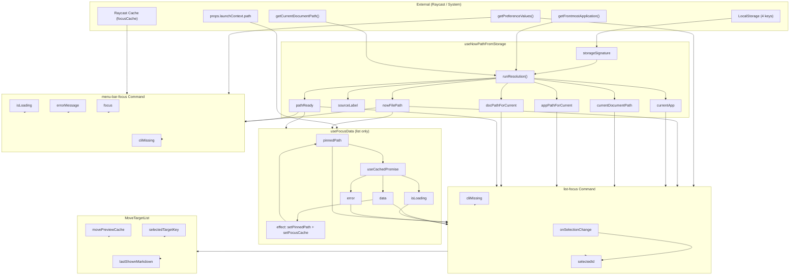
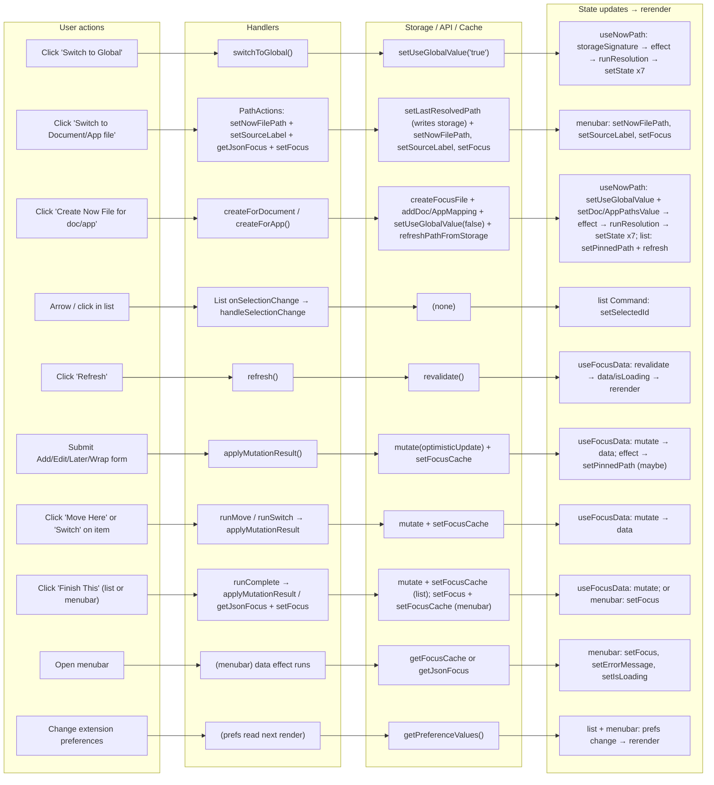

# Raycast Extension: State Change & Rerender Graph

A **comprehensive** graph of every state variable and every cause of a rerender in the main Raycast extension (list-focus and menu-bar-focus).

---

## 1. High-Level Architecture

```
┌─────────────────────────────────────────────────────────────────────────────────┐
│ EXTERNAL SOURCES (cause rerenders when they change)                              │
├─────────────────────────────────────────────────────────────────────────────────┤
│ • getPreferenceValues()     → prefs (list + menubar)                             │
│ • props.launchContext?.path → initialPinnedPath (list only)                      │
│ • Raycast LocalStorage      → useNowPathFromStorage (4 keys)                      │
│ • Raycast Cache (disk)      → focusCache read (menubar data effect)              │
│ • getFrontmostApplication() │ getCurrentDocumentPath() → async, then setState   │
│ • useCachedPromise internal → data, isLoading, error (useFocusData)            │
└─────────────────────────────────────────────────────────────────────────────────┘
                                        │
                                        ▼
┌─────────────────────────────────────────────────────────────────────────────────┐
│ HOOKS (own state + expose to commands)                                           │
├─────────────────────────────────────────────────────────────────────────────────┤
│ useNowPathFromStorage                                                             │
│   State: nowFilePath, sourceLabel, currentApp, currentDocumentPath,              │
│          appPathForCurrent, docPathForCurrent, pathReady                         │
│   Triggers: storageSignature, runResolution (async), setPathReady               │
│                                                                                   │
│ useFocusData (list only)                                                          │
│   State: pinnedPath (useState) + useCachedPromise(data, isLoading, error)         │
│   Triggers: path change → fetch; data → setPinnedPath + setFocusCache;           │
│             refresh/revalidate; applyMutationResult/mutate                        │
└─────────────────────────────────────────────────────────────────────────────────┘
                                        │
                                        ▼
┌─────────────────────────────────────────────────────────────────────────────────┐
│ COMMAND COMPONENTS                                                                │
├─────────────────────────────────────────────────────────────────────────────────┤
│ list-focus (Command)        │ menu-bar-focus (Command)                            │
│   Local state: selectedId,   │   Local state: focus, errorMessage, isLoading,     │
│   cliMissing                 │   cliMissing                                         │
│   Sub: MoveTargetList        │   (no sub-components with state)                    │
│     State: selectedTargetKey, movePreviewCache, lastShownMarkdown                 │
└─────────────────────────────────────────────────────────────────────────────────┘
```

---

## 2. Complete State Inventory

### 2.1 useNowPathFromStorage (`useNowPath.ts`)

| State Variable        | Type | Setter / Cause of Change |
|-----------------------|------|---------------------------|
| `nowFilePath`         | string | `setNowFilePath` (from runResolution or menu-bar "Switch to…") |
| `sourceLabel`         | string | `setSourceLabel` (from runResolution or menu-bar "Switch to…") |
| `currentApp`          | `{ name, bundleId? } \| null` | `setCurrentApp` (inside runResolution, from getFrontmostApplication()) |
| `currentDocumentPath` | string \| null | `setCurrentDocumentPath` (inside runResolution, from getCurrentDocumentPath()) |
| `appPathForCurrent`   | string \| null | `setAppPathForCurrent` (inside runResolution, from resolveNowPathFromContext) |
| `docPathForCurrent`   | string \| null | `setDocPathForCurrent` (inside runResolution, from resolveNowPathFromContext) |
| `pathReady`           | boolean | `setPathReady(true)` (after runResolution completes) |

**What triggers a rerender from useNowPath:**

1. **Storage values change** (any of these):
   - `useGlobalRaw` (NOW_USE_GLOBAL_KEY) → `setUseGlobal` (list/menubar) → `setUseGlobalValue`
   - `docPathsJson` (NOW_DOCUMENT_PATHS_KEY) → `setDocPathsValue` (addDocumentPathMapping)
   - `appPathsJson` (NOW_APP_PATHS_KEY) → `setAppPathsValue` (addAppPathMapping)
   - `lastResolvedPathRaw` (NOW_LAST_RESOLVED_PATH_KEY) → `setLastResolvedPathValue` (runResolution or setLastResolvedPath)

2. **Effect dependency** `storageSignature = useGlobalRaw|docPathsJson|appPathsJson|lastResolvedPathRaw`. The effect depends on `[storageLoading, storageSignature, runResolution]`. It returns early when `storageLoading` is true (storage not yet loaded). So the effect runs when storage has loaded and whenever `storageSignature` (or `runResolution`) changes — i.e. when any of the four LocalStorage keys change.

3. **Effect body**: `runResolution()` is called. It:
   - Calls `getCurrentDocumentPath()` and `getFrontmostApplication()` (async), then `setCurrentDocumentPath`, `setCurrentApp`.
   - Calls `resolveNowPathFromContext(...)`.
   - Calls `setNowFilePath`, `setSourceLabel`, `setAppPathForCurrent`, `setDocPathForCurrent`.
   - Optionally awaits `setLastResolvedPathValue(result.path)` (writes storage again).
   - The effect’s `.then(() => setPathReady(true))` runs after the promise resolves.

So: **any change to one of the four LocalStorage keys** → storage re-read → `storageSignature` change → effect runs → async resolution → **six setState calls + one setPathReady** → rerender.

4. **Direct setters from menu-bar (plus storage)**: When user chooses "Switch to Document file" or "Switch to {App} file" in PathActionsMenuSection, the handler calls `await setLastResolvedPath(...)` (writes storage), then `setNowFilePath(path)`, `setSourceLabel(label)`, and `setFocus(...)`. The direct setters cause an immediate rerender; the storage write may trigger useNowPath's effect when storage updates (same command).

---

### 2.2 useFocusData (`useFocusData.ts`)

| State Variable | Type | Setter / Cause of Change |
|----------------|------|---------------------------|
| `pinnedPath`   | string \| null | `setPinnedPath` (from effect when data arrives, or from list Command: switchToGlobal/Document/App, createForDocument/App) |
| (from useCachedPromise) `data` | FocusDataResult \| undefined | useCachedPromise: fetch completes, or `mutate(..., { optimisticUpdate })` |
| (from useCachedPromise) `isLoading` | boolean | useCachedPromise internal |
| (from useCachedPromise) `error` | Error \| undefined | useCachedPromise internal |

**What triggers a rerender from useFocusData:**

1. **`nowFilePath` or `initialPinnedPath` change** (props from Command):
   - `effectivePath = pinnedPath ?? nowFilePath` changes.
   - `pathForFetch = effectivePath ?? ""` changes.
   - useCachedPromise is keyed by `[pathForFetch]` → key change causes re-execution and loading state/data update → rerender.

2. **`setPinnedPath(path)`** (called from list Command):
   - Direct useState update → rerender.
   - Also changes `effectivePath` → may change what useCachedPromise is showing if fetch key changes.

3. **useCachedPromise internal updates** (any of):
   - **Initial execute**: `execute: !!effectivePath` — when effectivePath becomes non-null, fetch runs; when it completes, `data`/`isLoading`/`error` update → rerender.
   - **revalidate()** (exposed as `refresh()`): User or code calls refresh → revalidate → fetch runs again → when done, `data`/`isLoading`/`error` update → rerender.
   - **mutate(promise, { optimisticUpdate })** (used by `applyMutationResult`): Optimistic update runs → `data` updated in cache → rerender.

4. **Effect in useFocusData** (deps: `data?.focus?.key`, `data?.focus?.focus`, `data?.focus?.breadcrumb`, `data?.items?.length`, `effectivePath`):
   - When data arrives or changes, effect runs and calls `setPinnedPath((prev) => prev ?? effectivePath)`.
   - That can update `pinnedPath` → rerender.

---

### 2.3 list-focus Command (`list-focus.tsx`)

| State Variable | Type | Setter / Cause of Change |
|----------------|------|---------------------------|
| `selectedId`   | string \| null | `setSelectedId` (via handleSelectionChange; List's onSelectionChange) |
| `cliMissing`   | boolean \| null | `setCliMissing(null)` or `setCliMissing(!onPath)` (useEffect: runs isNowOnPath when showEmpty && error && !fileMissing; else setCliMissing(null)) |

**What triggers a rerender in list-focus Command:**

1. **Parent / hooks** (any change to):
   - `prefs` (getPreferenceValues) — if Raycast ever re-invokes with new prefs.
   - `props.launchContext?.path` — new launch.
   - **useNowPathFromStorage**: any of nowFilePath, sourceLabel, currentApp, currentDocumentPath, appPathForCurrent, docPathForCurrent, pathReady.
   - **useFocusData**: focus, items, error, errorMessage, isLoading, effectivePath, or identity of refresh/applyMutationResult/setPinnedPath (if they changed due to deps).

2. **Local state**:
   - **selectedId**: `handleSelectionChange(id)` → `setSelectedId((prev) => (prev === next ? prev : next))`. Called by Raycast List when user moves selection (arrow keys, click). If `id !== prev`, state updates → rerender. (Guard prevents loop when Raycast syncs same id.)
   - **cliMissing**: useEffect deps `[showEmpty, error, fileMissing]`. When showEmpty && error && !fileMissing, `isNowOnPath().then((onPath) => setCliMissing(!onPath))` → async setState → rerender. Otherwise `setCliMissing(null)` → rerender.

3. **Derived values** (do not cause rerender by themselves; they change when their deps change, which causes rerender):
   - currentKey, hasItems, showEmpty, fileMissing, nowInputLabel, pathForMutations, itemKeys, effectiveSelectedId, detailBySelection, detail, contextSection, otherSection, actionsFor*, actionsBySwitchItemKey, etc. All recomputed when the component runs — so any cause above that triggers a rerender will recompute these.

4. **useEffect (no deps array)** — debug log effect runs every render (no state update, but confirms render).

5. **useEffect [prefs.updateOneThing, focus?.focus, effectivePath]**: Can call `open(getOneThingUrl(...))`; no setState, so no rerender from this.

6. **Early returns**: `if (!pathReady)` and `if (showEmpty)` change the rendered branch; they don’t set state, but when pathReady or showEmpty flip (from hook state), component rerenders and may show different UI.

---

### 2.4 list-focus MoveTargetList (`list-focus.tsx`)

| State Variable       | Type | Setter / Cause of Change |
|----------------------|------|---------------------------|
| `selectedTargetKey`  | string \| null | `setSelectedTargetKey`: (1) useEffect when targets.length > 0 && selectedTargetKey === null; (2) List onSelectionChange(id) |
| `movePreviewCache`   | Record<string, string> | `setMovePreviewCache`: (1) preload effect per key; (2) selected-key fetch effect when cachedMarkdownForSelected was undefined |
| `lastShownMarkdown`  | string | `setLastShownMarkdown`: in effect when cachedMarkdownForSelected is defined or when fetch for selected key completes |

**What triggers a rerender in MoveTargetList:**

1. **Props change**: nowFilePath, currentKey, items, applyMutationResult, refresh → parent rerender passed new props.
2. **selectedTargetKey**: useEffect sets it to targets[0].key when targets.length > 0 && selectedTargetKey === null (deps: targets, selectedTargetKey). List onSelectionChange(id) → setSelectedTargetKey(id ?? null). Either → rerender.
3. **movePreviewCache**: Two effects update it (preload for first 5 targets; fetch for selected key when not in cache). Both call setMovePreviewCache → rerender.
4. **lastShownMarkdown**: Set in same effect as selected-key fetch / cachedMarkdownForSelected → rerender.

---

### 2.5 menu-bar-focus Command (`menu-bar-focus.tsx`)

| State Variable | Type | Setter / Cause of Change |
|----------------|------|---------------------------|
| `focus`        | `{ focus: string, breadcrumb: string } \| null` | `setFocus`: data effect (cache or getJsonFocus), or PathActionsMenuSection / Create file / Switch / Finish This handlers |
| `errorMessage` | string \| null | `setErrorMessage` in data effect when result has no data |
| `isLoading`    | boolean | `setIsLoading(true)` at start of data effect; `setIsLoading(false)` when cache or fetch settles |
| `cliMissing`   | boolean \| null | `setCliMissing(null)` or `isNowOnPath().then(... setCliMissing(!onPath))` in useEffect |

**What triggers a rerender in menu-bar-focus Command:**

1. **getPreferenceValues()**: prefs change (e.g. user edits extension preferences) → rerender.
2. **useNowPathFromStorage**: same as list — nowFilePath, sourceLabel, currentApp, currentDocumentPath, appPathForCurrent, docPathForCurrent, storageReady (pathReady) → rerender.
3. **Local state**:
   - **focus**: Set by data effect (cache hit or getJsonFocus result) or by any action that loads focus (Create file, Switch to Document/App, Create Focus File, Finish This) → rerender.
   - **errorMessage**: Set in data effect when result has no data → rerender.
   - **isLoading**: Set true at effect start, false when done → rerender.
   - **cliMissing**: useEffect deps [focus, isLoading]; when focus === null && !isLoading, async isNowOnPath().then(setCliMissing) → rerender; or setCliMissing(null) when focus !== null.
4. **useEffect [prefs.updateOneThing, focus?.focus]**: open(getOneThingUrl(...)); no setState.
5. **useEffect (no deps)** — debug log; no setState.

---

## 3. Rerender Cause Graph (Mermaid)



---

## 4. Exhaustive Rerender Triggers by Component

### 4.1 useNowPathFromStorage

| # | Trigger | Mechanism |
|---|--------|-----------|
| 1 | User toggles "use global" (list or menubar) | setUseGlobal → setUseGlobalValue → LocalStorage NOW_USE_GLOBAL_KEY changes → useLocalStorage returns new value → storageSignature changes → effect runs → runResolution → setState x6 + setPathReady |
| 2 | User adds document path mapping (list) | addDocumentPathMapping → setDocPathsValue → NOW_DOCUMENT_PATHS_KEY changes → storageSignature changes → effect → runResolution → setState x6 + setPathReady |
| 3 | User adds app path mapping (list) | addAppPathMapping → setAppPathsValue → NOW_APP_PATHS_KEY changes → storageSignature changes → effect → runResolution → setState x6 + setPathReady |
| 4 | runResolution writes last path | setLastResolvedPathValue(result.path) → NOW_LAST_RESOLVED_PATH_KEY changes → storageSignature changes on next read → effect runs again (after resolution) → runResolution again → setState x6 + setPathReady |
| 5 | User clicks "Switch to Document/App file" (menubar) | setLastResolvedPath(...) (writes storage); setNowFilePath(path); setSourceLabel(label); setFocus(...). Immediate rerender from setters; storage write may re-run useNowPath effect. |
| 6 | (When effect runs) default path from prefs | defaultPath is not in the effect deps; runResolution reads defaultPathRef.current. So changing extension preferences alone does not re-run the effect. When the effect runs for another reason (e.g. storage change), it uses the current defaultPath → result.path may reflect the new preference. |

### 4.2 useFocusData

| # | Trigger | Mechanism |
|---|--------|-----------|
| 1 | nowFilePath changes (from useNowPath) | effectivePath changes → pathForFetch changes → useCachedPromise key change → execute + loading/data → rerender |
| 2 | initialPinnedPath set (list launch with context) | pinnedPath can be set; effectivePath = pinnedPath ?? nowFilePath → same as above if path changes |
| 3 | setPinnedPath(path) called (list: switch/create actions) | useState update → rerender; effectivePath may change → useCachedPromise may re-run |
| 4 | useCachedPromise fetch completes | data, isLoading, error update → rerender |
| 5 | refresh() / revalidate() called | Re-fetch → when done, data/isLoading/error update → rerender |
| 6 | applyMutationResult(result) called | mutate(..., optimisticUpdate) → data updated → rerender; effect may also setPinnedPath(prev => prev ?? effectivePath) if not already set |
| 7 | Effect (data focus/items/effectivePath) runs | setPinnedPath(prev => prev ?? effectivePath) → rerender if prev was null |

### 4.3 list-focus Command

| # | Trigger | Mechanism |
|---|--------|-----------|
| 1–6 | Any useNowPath rerender cause | Hook state flows into Command → rerender |
| 1–7 | Any useFocusData rerender cause | Hook state flows into Command → rerender |
| 8 | getPreferenceValues() returns new object | Prefs reference or content change (e.g. preferences UI) → rerender |
| 9 | props.launchContext.path change | New launch with different context → initialPinnedPath change → useFocusData effectivePath → rerender |
| 10 | User changes list selection (arrow / click) | List calls onSelectionChange(id) → handleSelectionChange → setSelectedId(next) when next !== prev → rerender |
| 11 | showEmpty, error, fileMissing change and cliMissing effect runs | isNowOnPath().then(setCliMissing) or setCliMissing(null) → rerender |
| 12 | useMemo/useCallback deps change | New contextSection, otherSection, actionsFor*, detailBySelection, etc. → children receive new props → React may rerender children (same Command rerender already caused by state) |

### 4.4 MoveTargetList

| # | Trigger | Mechanism |
|---|--------|-----------|
| 1 | Parent (list-focus) rerender with new props | items, nowFilePath, currentKey, applyMutationResult, refresh change → rerender |
| 2 | useEffect [targets, selectedTargetKey]: first item select | setSelectedTargetKey(targets[0].key) → rerender |
| 3 | List onSelectionChange (Move "Move to…" list) | setSelectedTargetKey(id ?? null) → rerender |
| 4 | Preload effect [targets, nowFilePath] | getPreviewMarkdownForMove(...).then(md => setMovePreviewCache(...)) → rerender per key |
| 5 | Selected-key effect [nowFilePath, selectedTargetKey, cachedMarkdownForSelected] | setMovePreviewCache + setLastShownMarkdown when fetch completes → rerender |

### 4.5 menu-bar-focus Command

| # | Trigger | Mechanism |
|---|--------|-----------|
| 1–6 | Any useNowPath rerender cause | Hook state flows into Command → rerender |
| 7 | getPreferenceValues() returns new prefs | Same as list |
| 8 | Data effect [nowFilePath, storageReady] | getFocusCache or getJsonFocus → setFocus / setErrorMessage / setIsLoading → rerender |
| 9 | User action: Create file, Switch to…, Create Focus File, Finish This | Each calls setFocus(...) (and possibly setNowFilePath, setSourceLabel) → rerender |
| 10 | useEffect [focus, isLoading] for cliMissing | setCliMissing(null) or setCliMissing(!onPath) → rerender |
| 11 | useEffect [prefs.updateOneThing, focus?.focus] | open(...) only; no setState |

---

## 5. Cross-Command Data Flow (No Direct Rerender)

- **focusCache (Raycast Cache)**: list-focus writes via `setFocusCache` from useFocusData (effect and applyMutationResult). menu-bar-focus reads via `getFocusCache` in its data effect. Cache does not subscribe the menubar to list; menubar only reads when it opens or when its effect runs (nowFilePath / storageReady). So: **cache does not cause rerender in the other command**; it only affects what the menubar fetches when its effect runs.
- **LocalStorage**: Shared. Changing useGlobal or path mappings in list updates storage; when user opens menubar, useNowPath reads same storage → path resolution → same nowFilePath. So **rerenders are per-command**; the other command rerenders only when the user opens it and its hooks run.

---

## 6. Summary: Every Possible Cause of a Rerender

**useNowPathFromStorage:**  
Storage (useGlobal, docPaths, appPaths, lastResolvedPath) change → effect → runResolution → 7 setState calls. Or menubar-only: setNowFilePath / setSourceLabel.

**useFocusData:**  
nowFilePath or initialPinnedPath change; setPinnedPath; useCachedPromise (key change, fetch complete, revalidate, mutate); effect setPinnedPath(prev => prev ?? effectivePath).

**list-focus Command:**  
Any useNowPath or useFocusData rerender; prefs change; launchContext change; onSelectionChange → setSelectedId (when id changed); cliMissing effect → setCliMissing.

**MoveTargetList:**  
Parent rerender (new props); setSelectedTargetKey (useEffect or onSelectionChange); setMovePreviewCache; setLastShownMarkdown.

**menu-bar-focus Command:**  
Any useNowPath rerender; prefs change; data effect → setFocus / setErrorMessage / setIsLoading; any menu action that calls setFocus (or setNowFilePath / setSourceLabel); cliMissing effect → setCliMissing.

---

## 7. Additional Rerender / Update Notes

### 7.1 List selection sync (list-focus)

Raycast `List` can call `onSelectionChange` during or immediately after render (e.g. when syncing `selectedItemId`). If the handler always called `setSelectedId(id)`, that would schedule a state update every time, potentially causing a render loop. The guard in `handleSelectionChange` prevents that:

```ts
setSelectedId((prev) => (prev === next ? prev : next));
```

So a rerender from selection occurs **only when the new id is different from the current one**. Same id → same state → no rerender.

### 7.2 Navigation (push / pop)

List command uses `Action.Push` to show forms (AddNestedForm, LaterForm, EditForm, WrapForm, MoveTargetList). Those screens use `useNavigation()` and call `pop()` after submit. `pop()` changes the Raycast view stack (pops the pushed view). That does **not** set state in the list-focus Command; the Command rerenders only when it is again the top view and React re-runs it (e.g. when user navigates back). So push/pop are not direct rerender causes of the main Command; they affect which component is on screen.

### 7.3 useCachedPromise (from @raycast/utils)

- **Key** `[pathForFetch]`: When the key changes, the hook re-executes the promise and updates internal cache → `data`, `isLoading`, `error` update → consumer rerenders.
- **revalidate()**: Triggers a new fetch; when it completes, same internal update → rerender.
- **mutate(promise, { optimisticUpdate })**: Applies `optimisticUpdate` to the cached data immediately → rerender; optional revalidate after.

Any of these can trigger a rerender in any component that uses `useFocusData` (the list-focus Command).

### 7.4 Refs (do not cause rerender)

- `listFocusRenderCount`, `menubarRenderCount`: Incremented during render; no setState.
- `hasDeferredOneThingSync`: Read/written in effect; no setState in render.
- `preloadStartedRef` (MoveTargetList): Mutated in effect; no setState from ref mutation.
- Refs in useNowPath (`defaultPathRef`, `appSpecificNowFilesRef`, `useGlobalRef`, etc.): Updated during render for use inside `runResolution`; ref mutation does not trigger rerender.

---

## 8. User Action → setState Chain (Mermaid)

Diagram: **user action** → **handler** → **storage/setter/cache** → **hook or component state** → **rerender**. Each chain ends at the component(s) that rerender.



**List-specific actions not in diagram (same pattern):**  
Switch to Document/App (list) → `setUseGlobal(false)` + `setLastResolvedPath` + `refreshPathFromStorage` + `setPinnedPath` → storage effect → runResolution → setState x7; plus setPinnedPath → list rerender. Create for doc/app (list) → same storage/mapping chain + `setPinnedPath(path)` + `refresh()` → useFocusData fetch → data update → rerender.

**MoveTargetList:**  
User opens Move screen → parent already rerendered (Action.Push). User arrows in Move list → `onSelectionChange` → `setSelectedTargetKey` → MoveTargetList rerender. Preload / selected-key effects → `setMovePreviewCache` / `setLastShownMarkdown` → MoveTargetList rerender.

---

## 9. Deep Drill-Down: list-focus Command

Every trigger that can cause the list-focus Command to rerender, with **source location**, **condition**, and **order (sync vs async)**.

### 9.1 Entry: Command render

The Command function runs when:

- React re-runs the component (parent re-render, or state update in this component or in a hook it uses).
- Raycast re-mounts the command (e.g. user re-opens the list).

**State and hooks (order of execution):**

| Order | Code | What runs | Rerender? |
|-------|------|-----------|------------|
| 1 | `getPreferenceValues<Preferences>()` | Prefs read (could be new ref if Raycast re-runs) | Only if prefs identity/content changed and React already rerunning for another reason, or Raycast passed new props. |
| 2 | `useState<string \| null>(null)` for selectedId | Initial or current selectedId | N/A (this is the state). |
| 3 | `useNowPathFromStorage({ defaultPath, appSpecificNowFiles })` | Hook runs; returns nowFilePath, pathReady, etc. | If any of the hook’s state (see §2.1) changed, hook already caused this rerender. |
| 4 | `useFocusData(pathReady ? nowFilePath : null, initialPinnedPath)` | Hook runs; returns focus, items, refresh, applyMutationResult, setPinnedPath, effectivePath, etc. | If any of the hook’s state (see §2.2) changed, hook already caused this rerender. |
| 5 | `useState<boolean \| null>(null)` for cliMissing | Initial or current cliMissing | N/A. |
| 6 | useCallback / useMemo / useEffect | Callbacks and derived values; effects scheduled. | Effects don’t cause this render; they can cause the *next* render. |

So a **rerender** of the Command is caused by: (a) useNowPath state update, (b) useFocusData state update, (c) local setState (selectedId or cliMissing), (d) parent/props (prefs, launchContext), or (e) Raycast re-mounting.

### 9.2 Triggers from useNowPathFromStorage

| Trigger | Where it originates | Condition | setState chain | Sync/async |
|---------|---------------------|-----------|----------------|------------|
| Storage key change | list or menubar: setUseGlobalValue, setDocPathsValue, setAppPathsValue, setLastResolvedPathValue | Any of the 4 LocalStorage keys changes | useLocalStorage returns new value → storageSignature changes → effect runs → runResolution() → setCurrentDocumentPath, setCurrentApp, setNowFilePath, setSourceLabel, setAppPathForCurrent, setDocPathForCurrent, setPathReady | Async (runResolution is async) |
| Menubar “Switch to…” | menu-bar-focus PathActionsMenuSection | User clicked Switch to Document/App file | setLastResolvedPath(...) (writes storage), setNowFilePath(path), setSourceLabel(label), setFocus(...) in menubar; immediate rerender; storage write may re-run useNowPath effect. When list is open, list’s switchToDocument/switchToApp use setUseGlobal + setLastResolvedPath + refreshPathFromStorage + setPinnedPath → storage write → same as above | Sync (setters); storage update may trigger async effect in menubar; async in list (refreshPathFromStorage = runResolution) |

So for **list-focus**: every time the list updates path/context it does either (1) setPinnedPath only (immediate rerender), or (2) storage write → useNowPath effect → runResolution → 7 setState (async rerender). When menubar switches, list doesn’t see it until list’s useNowPath next runs (e.g. list open and storage changed elsewhere, or list re-mounted).

### 9.3 Triggers from useFocusData

| Trigger | Where it originates | Condition | setState chain | Sync/async |
|---------|---------------------|-----------|----------------|------------|
| nowFilePath / initialPinnedPath change | Command props / useNowPath return | pathReady or nowFilePath or initialPinnedPath changed | effectivePath changes → useCachedPromise key [pathForFetch] changes → hook re-executes → when fetch completes: data, isLoading, error update | Async |
| setPinnedPath(path) | switchToGlobal, switchToDocument, switchToApp, createForDocument, createForApp (list) | User chose switch or create | useState setPinnedPath → Command rerender; effectivePath may change → useCachedPromise may run (same as above) | Sync (setPinnedPath); async if fetch re-runs |
| useCachedPromise fetch completes | useFocusData internal | execute: !!effectivePath and fetch resolved | data, isLoading, error update → useFocusData return value changes → Command rerender | Async |
| refresh() | User “Refresh” or createForDocument/createForApp | revalidate() called | useCachedPromise revalidates → fetch → same as above | Async |
| applyMutationResult(result) | runNav, form submit (Add/Edit/Later/Wrap), Move Here, Switch on item | Mutation ran and returned result | mutate(Promise.resolve(), { optimisticUpdate }) → data updated in cache → Command rerender; effect may call setPinnedPath(prev => prev ?? effectivePath) | Sync (optimistic update); effect async |
| Effect “pin on first data” | useFocusData effect | data?.focus present, effectivePath set, pinnedPath was null | setPinnedPath(prev => prev ?? effectivePath) → Command rerender | Sync (setState in effect) |

So for **list-focus**: any change in path (from useNowPath or setPinnedPath), any fetch completion, refresh, or applyMutationResult can update useFocusData’s returned focus/items/error/isLoading/effectivePath and thus rerender the Command.

### 9.4 Local state: selectedId

| Trigger | Where it originates | Condition | setState chain | Sync/async |
|---------|---------------------|-----------|----------------|------------|
| List onSelectionChange(id) | Raycast List | User arrow key or click; or List syncing selectedItemId | handleSelectionChange(id) → setSelectedId(prev => prev === next ? prev : next) | Sync; **no** update when id === prev (avoids loop) |

Single source: List. One setState per **distinct** selection change.

### 9.5 Local state: cliMissing

| Trigger | Where it originates | Condition | setState chain | Sync/async |
|---------|---------------------|-----------|----------------|------------|
| useEffect [showEmpty, error, fileMissing] | list-focus.tsx ~411–417 | showEmpty && error && !fileMissing → run isNowOnPath().then(setCliMissing(!onPath)); else setCliMissing(null) | setCliMissing(null) or setCliMissing(!onPath) | Async (isNowOnPath) or sync (setCliMissing(null)) |

So: empty + error + file exists (!fileMissing) → async check → setCliMissing(!onPath) → rerender. When showEmpty && error && fileMissing, or when !showEmpty or !error, effect sets cliMissing to null → rerender.

### 9.6 Props / parent

| Trigger | Where it originates | Condition | Rerender? |
|---------|---------------------|-----------|-----------|
| getPreferenceValues() | Raycast | Extension preferences might change; API may return new ref when prefs change | If prefs change, next time Command runs (e.g. after another trigger) it sees new prefs. No dedicated “prefs changed” subscription; rerender only if something else already caused a render. |
| props.launchContext?.path | Raycast launch | User opened list with context (e.g. deeplink from menubar) | Only on mount / re-mount with new launchContext. |

So “prefs change” or “launchContext change” only cause a rerender when the Command is already re-running (e.g. from hook or local state) or when the command is re-mounted.

### 9.7 Order of updates in one “turn”

When multiple things update in one turn (e.g. storage changed and runResolution finishes):

1. useNowPath effect runs (storageSignature changed) → runResolution() scheduled.
2. runResolution() resolves → setCurrentDocumentPath, setCurrentApp, setNowFilePath, setSourceLabel, setAppPathForCurrent, setDocPathForCurrent (batch), then setPathReady(true). React batches these → **one** rerender from useNowPath.
3. If nowFilePath changed, useFocusData’s useCachedPromise key changed → fetch started; when it completes, useCachedPromise updates → **another** rerender.
4. useFocusData effect (data + effectivePath) may run after that and call setPinnedPath(prev => prev ?? effectivePath) → **another** rerender if pinnedPath was null.

So one storage change can lead to: 1 rerender (useNowPath) + 1 rerender (useFocusData fetch) + optionally 1 more (setPinnedPath in effect).

### 9.8 Summary table: list-focus Command rerender causes

| Cause | Source | Immediate or after async? |
|-------|--------|---------------------------|
| useNowPath: storage → runResolution | useNowPath.ts effect | After async (runResolution) |
| useNowPath: setNowFilePath/setSourceLabel (menubar only) | menu-bar-focus | Immediate (when menubar is open) |
| useFocusData: path change → fetch | useFocusData + useCachedPromise | After async (fetch) |
| useFocusData: setPinnedPath | list switch/create actions | Immediate |
| useFocusData: revalidate / refresh | refresh() | After async (fetch) |
| useFocusData: mutate (applyMutationResult) | runNav, forms, Move, Switch | Immediate (optimistic) |
| useFocusData: effect setPinnedPath | useFocusData effect | Immediate (effect run) |
| selectedId change | List onSelectionChange | Immediate (guarded) |
| cliMissing update | useEffect isNowOnPath / setCliMissing(null) | After async or immediate |
| Prefs / launchContext | Raycast | On next render or mount |

---

This document and the Mermaid graphs describe every state variable, every cause of a rerender, every user-action → setState chain, and a full drill-down for the list-focus Command.
